# 体験予約システム 操作マニュアル（会社担当者用）

開催企業のご担当者さま向けのマニュアルです。
画面右上のバッジが「**会社担当者**」になっているアカウントで使える機能を説明します。

**日時はすべて日本時間です。**

> 研修や配布に使えるスライド版があります → **[manual-company.pptx](manual-company.pptx)**（PowerPoint、17 ページ）。内容はこの文書と同じです。

---

## 目次

1. [できること・できないこと](#1-できることできないこと)
2. [ログイン](#2-ログイン)
3. [体験プログラムを登録する](#3-体験プログラムを登録する)
4. [開催回を作る](#4-開催回を作る)
5. [申込者を確認する](#5-申込者を確認する)
6. [キャンセル待ちの繰り上げ](#6-キャンセル待ちの繰り上げ)
7. [中止・延期のお知らせを送る](#7-中止延期のお知らせを送る)
8. [よくあるご質問](#8-よくあるご質問)

---

## 1. できること・できないこと

### できること

- 自社の体験プログラムの登録・編集
- 自社の開催回の登録・編集（まとめて作ることもできます）
- 自社の申込者の確認・CSV 出力
- 自社の申込者のキャンセル待ち繰り上げ・キャンセル
- **自社の申込者へのお知らせメールの一斉送信**

### できないこと（事務局にご依頼ください）

- 会社情報（会社名・エリアなど）の登録・変更
- 管理画面アカウントの発行、パスワードの再発行
- 予約受付全体の開始・停止
- **全申込者**への一斉送信（自社の申込者にのみ送れます）
- メール送信状況の詳細画面

**他社の情報は一切表示されません。** 他社のページの URL を直接入力した場合も「ページが見つかりません」となります。

---

## 2. ログイン

管理画面の URL は **`（サイトのURL）/admin`** です。事務局から受け取ったユーザー名とパスワードでログインしてください。

- **パスワードをご自身で変更する画面はありません。** 分からなくなった場合は事務局にご連絡いただくと、新しいパスワードを発行します。
- **10 回続けて間違えると 15 分間ログインできなくなります。** 心当たりのあるパスワードを試し続けるより、事務局にご相談いただくほうが早く解決します。
- **30 分何も操作しないと自動的にログアウト**します。また、ログインから **8 時間**でログアウトします。長い入力の途中は、こまめに保存してください。

### メニュー

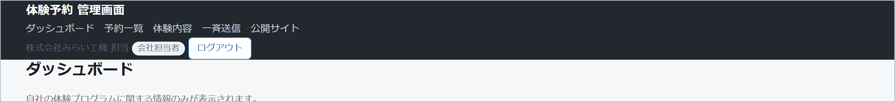

| メニュー | 内容 |
|---|---|
| ダッシュボード | 自社の件数と、繰り上げ候補のある開催回 |
| 予約一覧 | 自社の申込者の確認・CSV 出力・繰り上げ・キャンセル |
| 体験内容 | 自社の体験プログラムと開催回の登録・編集 |
| 一斉送信 | 自社の申込者へのお知らせメール |
| 公開サイト | 申込者から見える画面を別タブで開きます |

どの画面も**自社のぶんだけ**が表示されます。

---

## 3. 体験プログラムを登録する

「体験内容」→「体験プログラムを登録」。

| 項目 | 説明 |
|---|---|
| 主催会社 | 自社が選択されています |
| 体験プログラム名 | 公開側とメールの件名に使われます |
| 説明 | 改行は反映されます。HTML は使えません |
| 会場 | 受付場所・集合場所など。当日迷われないよう具体的にご記入ください |
| 表示順 | 小さいほど上に表示されます |
| 公開する | チェックを外すと公開側に出ません |
| 1予約あたりの上限人数 | 1 件の予約で申し込める人数の上限（既定 20 名） |
| 対象年齢の下限・上限 | **両方とも空欄で構いません。** 片方だけの設定もできます |
| 付き添いの保護者も参加人数に含める | 下記参照 |
| 予約不要 | 下記参照 |
| 外部リンクURL | 自社の紹介ページなど。`https://` から入力してください |

> **公開されるには、会社側も「公開」になっている必要があります。** チェックを入れても公開側に出ない場合は、事務局にご確認ください。

### 「付き添いの保護者も参加人数に含める」

- **チェックする** … 親子で一緒に体験するなど、**来場する全員が参加者**の場合。定員＝来場人数になります。
- **チェックしない** … 体験するのはお子さまだけで、保護者は見学される場合。予約画面に「付き添いの人数」欄が出ます。
  **付き添いの方は定員を消費しません。** 会場の収容を確認されるときは、予約一覧と CSV の「**来場人数**」（参加人数＋付き添い）をご覧ください。

### 「予約不要」

チェックすると**予約ボタンが出なくなります**が、**開催時間は時間割として公開側に表示され続けます**。
「申込は不要ですが、この時間に実施しています」とお知らせしたいときにお使いください。あとでチェックを外せば、同じ開催回のまま受付が始まります。

### 対象年齢について

予約時に入力された**すべての方の年齢**を確認し、**1 人でも範囲外なら受け付けません**。
**すでに受け付けた予約は、あとから範囲を変えても取り消されません。**

---

## 4. 開催回を作る

「体験内容」の一覧から、対象の行の「**開催回**」を開きます。

### 1 件ずつ作る

| 項目 | 説明 |
|---|---|
| 開始日時・終了日時 | 日本時間 |
| 定員（人数） | **人数単位です。** 3 名で申し込まれたら 3 席消費します |
| 受付状態 | 受付中／受付終了 |

### まとめて作る（一括作成）

「一括作成」で、**初回の開始日時・所要時間（分）・間隔（分）・回数・定員**を入力すると、等間隔の開催回をまとめて作れます。

- 「間隔」は前の回の終了から次の回の開始までの休憩時間です。0 にすると隙間なく連続します。
- 例: 初回 10:00 / 所要 45 分 / 間隔 15 分 / 6 回 → 10:00、11:00、12:00 … と 6 回作られます。

### 受付を止めたいとき

**「受付終了」に変更**してください。公開側から消え、既存の予約はそのまま残ります。
**予約が入っている開催回は削除できません。** 削除ではなく「受付終了」をお使いください。

---

## 5. 申込者を確認する

「予約一覧」で、体験プログラム・開催回・状態・メールアドレスで絞り込めます。

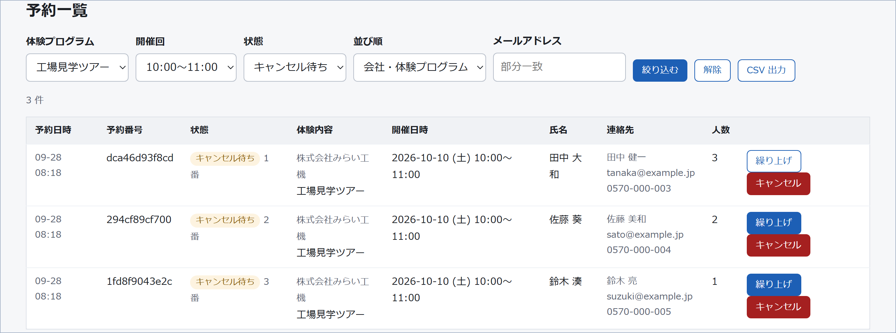

### 当日の名簿をつくる

**並び順**を「**会社・体験プログラム・開催日時順**」にすると、開催回ごとにまとまり、同じ回の中では 確定 → キャンセル待ち → キャンセル済み の順に並びます。当日の点呼にはこちらが便利です。

「**CSV 出力**」を押すと、**絞り込んだ結果だけ**が出ます。Excel でそのまま開けます（文字化けしません）。

### 「氏名」と「連絡先氏名」の違い

- **氏名・参加者** … 実際に体験される方（当日お呼びする方）
- **連絡先氏名・メールアドレス・電話番号** … 連絡を取る相手（お子さまの体験なら保護者の方）

**メールの宛名は「連絡先氏名」です。**

### 「開催企業へのメッセージ」

申込時に自由記入でいただいた内容です（アレルギー、車椅子のご利用など）。**開催前に必ずご確認ください。** 予約一覧と CSV に出ています。

### 状態の意味

| 状態 | 意味 |
|---|---|
| 確定 | 席が確保されています。当日いらっしゃいます |
| キャンセル待ち | 満席のため待機中です。**繰り上げるまで確定しません** |
| キャンセル済み | 来場されません |

---

## 6. キャンセル待ちの繰り上げ

キャンセル待ちの方を「確定」に切り替える操作です。
**この章がこのマニュアルでいちばん間違えやすいところ**ですので、少し詳しくご説明します。

### 6-1. なぜ空席が空いたままになるのか

**キャンセル待ちの方が 1 人でもいる開催回では、席が空いていても、新しい予約はキャンセル待ちになります。**
あとから予約された方が、先にお待ちの方を追い越さないようにするためです。

そして、**空いた席は自動では埋まりません。** 繰り上げの操作をするまで空いたままです。

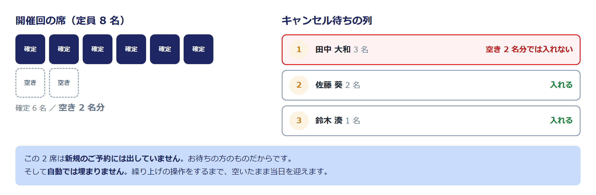

つまり、**何もしないと「空席があるのに、お待ちの方も参加できない」状態のまま当日を迎えます。**
毎日ダッシュボードの「繰り上げ候補のある開催回」をご確認ください。

> キャンセルしたときに「空きにより N 件を自動で繰り上げました」と表示された場合は、システムの設定で自動繰り上げが有効になっています。
> 現在は自動繰り上げを行わない設定ですので、このメッセージは通常出ません。出た場合は事務局にご確認ください。

### 6-2. 繰り上げの手順

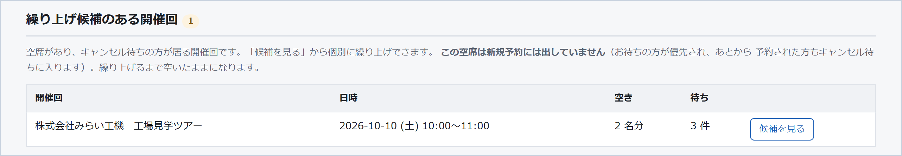

1. ダッシュボードの「**繰り上げ候補のある開催回**」を見ます。空席があり、お待ちの方がいる開催回が並んでいます。「空き」と「待ち」の人数も出ています。
2. 「**候補を見る**」を押すと、その開催回のキャンセル待ちの方だけが表示されます。
3. 繰り上げる方の行の「**繰り上げ**」を押します。確認のポップアップが出ます。
4. 成功すると「**繰り上げました。◯◯ 様（予約番号）の参加が確定し、ご本人にメールをお送りしています。**」と表示されます。

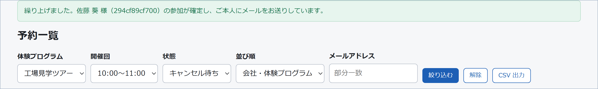

お待ちの順番は、状態の欄に「**キャンセル待ち ◯ 番**」として出ています。番号が小さい方が先にお申し込みの方です。

> **並び順にご注意ください。** 既定は「予約日時（新しい順）」なので、**お待ちの順番とは逆**に並びます。
> 順番どおりに見たいときは、並び順を「**会社・体験プログラム・開催日時順**」に変えてください。

> **申込者ご自身にも、自分が「キャンセル待ち ◯ 番目」であることが見えています**（予約完了メールの URL から確認できます）。
> 順番を飛ばして繰り上げると、飛ばされた方は気づきます。この点は 6-3 の手段 C でご説明します。

### 6-3. 空きより、繰り上げたい方の人数が多いとき

いちばん多いお困りごとです。たとえば **空きが 2 名分なのに、先頭でお待ちの方が 3 名**というときです。

#### まず、画面での見分け方

- **「繰り上げ」ボタンが薄いグレー**になっています。マウスを載せると「現在の空きでは足りません」と出ます。
- それでも押すと、「**空席が足りません（この予約は 3 名、空きは 2 名分）。**」と表示され、**繰り上げは行われません。**
- **押しても席は動きません。予約も壊れません。** 迷ったら押して確かめていただいて構いません。

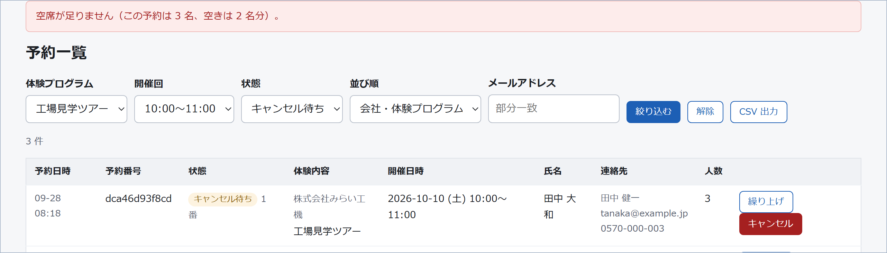

#### 取れる手立ては 5 つあります

| | 方法 | どんなときに |
|---|---|---|
| **A** | **そのまま待つ** | 開催までまだ日があるとき。原則はこれです |
| **B** | **定員を増やす** | 会場と運営に余裕があるとき |
| **C** | **人数の収まる別の方を先に繰り上げる** | 開催が近く、空席を埋めたいとき（順番の追い越しになります） |
| **D** | **人数を減らして取り直していただく** | 3 名のうち 2 名だけなら参加できる、とご本人が言われたとき |
| **E** | **別の回に振り替えていただく** | 空きのある別の回があるとき |

---

#### A. そのまま待つ（原則）

追加のキャンセルが出れば、そのまま先頭の方を繰り上げられます。
**お待ちの順番を守れるのはこの方法だけ**ですので、開催まで日があるうちは A をおすすめします。

前日になっても埋まらない場合に、B〜E をご検討ください。

#### B. 定員を増やす

会場の収容と運営体制に余裕があるなら、開催回の「定員」を増やすのがもっとも角が立ちません。

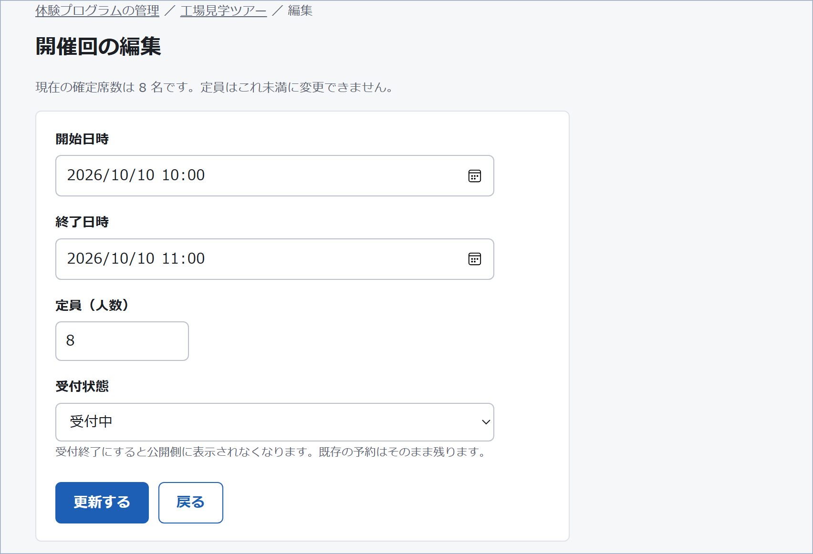

1. 「体験内容」→ 対象の行の「開催回」→ その回の「編集」
2. 「定員（人数）」を増やして更新
3. **増やしただけでは繰り上がりません。** そのあと予約一覧に戻って「繰り上げ」を押してください

注意点:

- **定員は、現在の確定席数より小さくはできません。** 減らそうとすると「定員は現在の確定席数（N 名）未満には変更できません」と出ます。
- 定員を増やしても、**キャンセル待ちの方がいる間は、公開側の表示は「キャンセル待ち 現在 N 件」のままです**（「残り N 名」にはなりません）。増えた席が通りがかりの方に先に取られる心配はありませんので、落ち着いて繰り上げてください。お待ちの方を全員繰り上げてキャンセル待ちが 0 件になると、表示が「残り N 名」に変わり、新しい予約を受け付けます。
- 「付き添いの保護者も参加人数に含める」をチェックしていない体験プログラムでは、**付き添いの方は定員に含まれません。** 会場の収容を判断されるときは「来場人数」をご覧ください。

#### C. 人数の収まる別の方を先に繰り上げる（順番の追い越し）

空きが 2 名分で、1 番目が 3 名、2 番目が 2 名のとき、**2 番目の方は繰り上げられます。**

ただしこれは**順番の追い越し**です。システムは止めませんが、運用上の判断が必要です。

- 追い越すと席が埋まり、**1 番目の方はさらに待つことになります**（追加のキャンセルが出ないと参加できません）。
- **1 番目の方には「キャンセル待ち 1 番目」と表示されたままです。** あとから「1 番目なのに参加できなかった」というお問い合わせにつながる可能性があります。

一方で、追い越さなければ**2 席が空いたまま当日を迎え、参加できたはずの方も参加できません。**

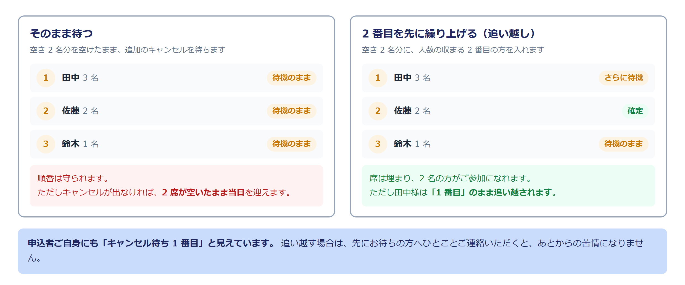

**判断の目安:**

| 状況 | おすすめ |
|---|---|
| 開催まで日がある | **A（待つ）** |
| 会場に余裕がある | **B（定員を増やす）** |
| 開催直前で、空席を埋めたい | **C**。ただし下記をお願いします |
| 判断に迷う | **事務局にご相談ください** |

C を選ぶ場合は、**先にお待ちの方（追い越される方）にご連絡いただくことを強くおすすめします。**
「◯名様の枠が確保できず、恐れ入りますがこのままお待ちいただくか、別の回へお振り替えいただけますでしょうか」とご案内すれば、後からの苦情になりません。

#### D. 人数を減らして取り直していただく

「3 名で申し込んだが、2 名だけなら参加したい」と言われた場合です。

**予約の人数を変更する機能はありません。** いったんキャンセルして、正しい人数で取り直していただくことになります。

**ここに落とし穴があります。取り直すと、その方の待ち順は最初からになります。**

- 取り直した時点で**他にキャンセル待ちの方がいなければ**、空席の範囲で**そのまま確定**になります。
- 取り直した時点で**他にキャンセル待ちの方がいれば**、空席があっても**キャンセル待ちの最後**に並びます。

したがって、**この方法をご案内する前に、予約一覧でその開催回のキャンセル待ちが「その方だけ」になっていることを必ず確認してください。**
他にお待ちの方がいる状態でキャンセルしていただくと、**その方は席を失ったうえに列の最後に回る**ことになり、取り返しがつきません。

ご案内の文例:

> 現在この回は他にお待ちの方がいらっしゃらないため、いま 3 名のご予約をキャンセルして 2 名で取り直していただければ、そのままご参加が確定します。
> 順番が後ろになることはありません。お手数ですが、予約完了メールの URL からキャンセルのうえ、改めてお申し込みください。

#### E. 別の回に振り替えていただく

空きのある別の回があるなら、そちらをご案内するのがもっとも確実です。これも**キャンセル → 取り直し**になります。

- **同じ体験プログラムの別の回を、重ねて予約することはできません。** 先にキャンセルしていただく必要があります。
- 振り替え先の回に**他にお待ちの方がいないこと**を先にご確認ください（理由は D と同じです）。

### 6-4. 複数の方をまとめて繰り上げるとき

空きが 5 名分で、キャンセル待ちが **1 番目 3 名 / 2 番目 1 名 / 3 番目 2 名 / 4 番目 1 名**のように並んでいる場合です。

**はじめに、並び順を「会社・体験プログラム・開催日時順」に変えてください。**
既定の「予約日時（新しい順）」のままだと、**お待ちの順番と逆**（新しくお申し込みの方が上）に並んでしまいます。

並べ替えたら、**上から順に「繰り上げ」を押してください。** 入る方は入り、入らない方はエラーになるだけですので、順に押していけば安全です。

ただし、**押す順番で結果が変わります。**

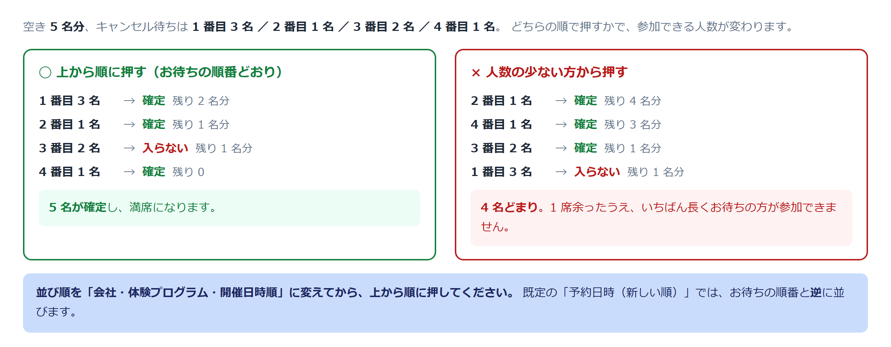

| 押す順番 | 結果 |
|---|---|
| **上から順（1 番目から）** | 3 名 → 1 名 → （残り 1 名分なので 2 名は入らず）→ 4 番目の 1 名 … 計 **5 名が確定**、満席 |
| 人数の小さい方から | 1 名 → 1 名 → 2 名 → （残り 1 名分）→ **1 番目の 3 名はいつまでも入れません** |

**人数の大きい方を先に試す**のが原則です。小さい人数から埋めると、残った隙間に大人数の方が入れなくなり、**いちばん長く待っている方がいちばん参加できない**という結果になります。

上から順に押していけば自然とそうなりますので、**迷ったら上から順**で問題ありません。

### 6-5. 空き以外の理由で繰り上げできないとき

空席は足りているのに繰り上げられない場合、次のメッセージが出ます。

| メッセージ | 意味と対処 |
|---|---|
| **この予約はキャンセル待ちではありません（既に処理済みの可能性があります）。** | 別の担当者が先に繰り上げたか、ご本人がキャンセルされました。**画面を再読み込み**してご確認ください |
| **繰り上げできません。この方は同じ体験プログラムの別の回を既にご予約済みです。** | お待ちの間に、同じ体験プログラムの別の回を予約されています。**そちらでご参加いただく**のが基本です。この回をご希望なら、ご本人に別の回をキャンセルしていただく必要があります |
| **繰り上げできません。この方は時間帯の重なる予約を既に持っています（◯◯「△△」）。** | お待ちの間に、同じ時間帯に他社の体験を予約されています。**どちらかをご本人にキャンセルしていただく**必要があります。メッセージにどの予約と重なっているか出ています |

いずれも**システムが二重予約を防いでいる**ためのメッセージです。無理に通す方法はありませんので、ご本人への確認をお願いします。

### 6-6. キャンセルする

予約一覧の「キャンセル」ボタンです。**この操作は取り消せません。** ご本人に通知メールが送られます。

確定していた予約をキャンセルすると席が空きますが、**その席はキャンセル待ちの方のものです**。忘れずに繰り上げてください。

なお、申込者ご自身も、予約完了メールの URL からキャンセルできます。お電話でキャンセルのご連絡があった場合は、そちらをご案内いただくか、この画面で操作してください。

### 6-7. 開催前日までの確認

- [ ] ダッシュボードの「**繰り上げ候補のある開催回**」が 0 件になっているか（残っていれば、6-3 の A〜E をご検討ください）
- [ ] 繰り上げた方に確定メールが届いているか（届かないというお問い合わせがあれば事務局へ）
- [ ] 「**開催企業へのメッセージ**」を確認したか（アレルギー、車椅子のご利用など）
- [ ] 当日の名簿を CSV で出力したか（並び順は「会社・体験プログラム・開催日時順」が便利です）

---

## 7. 中止・延期のお知らせを送る

台風などで中止・延期になったときに、**自社の申込者にまとめてメールを送れます**。

### 手順

**① 新しい申込を止める**

中止する回を「**受付終了**」に変更します（→ [4 章](#4-開催回を作る)）。
**開催情報は表示されたままです。** 止まるのは新しい申込だけです。

**② 「一斉送信」を開く**

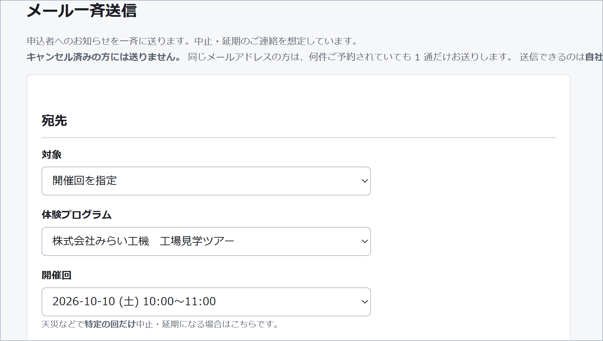

| 項目 | 選びかた |
|---|---|
| 対象 | **体験プログラムを指定** / **開催回を指定** |
| キャンセル待ちの方も含める | 中止・延期のお知らせなら**チェックを推奨**します（その方も予定を空けていらっしゃいます） |
| 件名・本文 | 下記参照 |

- **1 日だけ中止**なら「**開催回を指定**」です。関係のない回の申込者に送らずに済みます。
- **キャンセル済みの方には送りません。**
- **同じメールアドレスの方は、何件ご予約されていても 1 通だけ**届きます。
- **体験内容と開催日時は本文の先頭に自動で入ります。** 受け取った方が「どの予約の話か」で迷わないようにするためです。本文には中止・延期の事実と、振替のご案内だけお書きいただければ足ります。

**③ 送信前に必ず確認する**

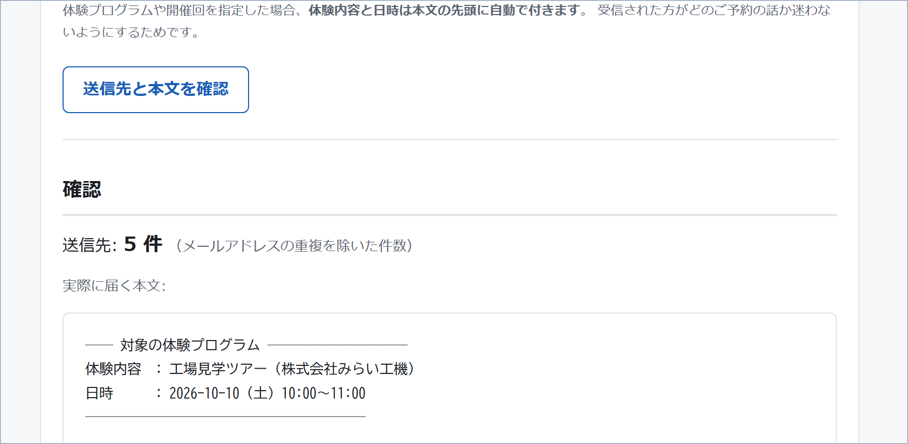

1. 「**送信先と本文を確認**」を押すと、**送信件数**と**実際に届く本文**が表示されます。
2. 「**まず自分宛に試す**」で、ご自身のアドレスに 1 通送ってください。**この 1 通が届くかで、本送信が届くかが分かります。**
3. 「**N 件に送信する**」を押します。確認のポップアップが出ます。**送信後は取り消せません。**

**④ 送信されるまで**

送信はいったん順番待ちに入り、順次送られます（**完了まで数分かかることがあります**）。
お急ぎの場合や、「届かない」というお問い合わせがあった場合は、**事務局にご連絡ください。** 送信状況を確認できるのは事務局の画面です。

### 文例

```
件名: 【9月12日】台風接近に伴う開催中止のお知らせ

このたびご予約いただいた体験プログラムにつきまして、
台風接近により開催を中止することといたしました。
ご準備いただいたところ誠に申し訳ございません。

振替開催につきましては、日程が決まりしだい改めてご案内いたします。
ご質問は本メールにご返信いただくか、下記までお問い合わせください。

（自社の連絡先）
```

（体験内容と開催日時は自動で本文の先頭に付くため、上の文に書く必要はありません。）

### ご注意

- **一斉送信は取り消せません。** 対象の選び間違い（体験プログラム全体 / 特定の回）にとくにご注意ください。
- 送信できるのは**自社の申込者のみ**です。「全申込者」は事務局だけの機能です。

---

## 8. よくあるご質問

### 登録したのに公開側に出てきません

次の 4 つすべてが必要です。

1. **会社が公開**になっている（← 事務局にご確認ください）
2. **体験プログラムが「公開する」**になっている
3. **開催回が「受付中」**になっている
4. 事務局が**全体の受付を停止していない**

1 と 4 は事務局側の設定です。2 と 3 を確認しても出てこない場合は、事務局にご連絡ください。

### 予約ボタンが出ません

上記のほか、次もご確認ください。

- 体験プログラムが「**予約不要**」になっていませんか
- その開催回が「**受付終了**」になっていませんか

### 満席なのに空席があると言われました

キャンセル待ちの方がいる開催回では、空席があっても新規予約はキャンセル待ちになります（→ [6 章](#6-キャンセル待ちの繰り上げ)）。
その席はお待ちの方のものですので、「**繰り上げ**」で対応してください。

### 同じ方が複数の回に申し込めません

**1 人 1 体験プログラム 1 予約**です。同じ体験プログラムの別の回を重ねて予約することはできません。
また、**時間帯の重なる別の予約**（他社の体験も含みます）もお取りいただけません。
さらに、前後の予約との間隔が短い（15 分以下）場合は、移動時間を考慮した警告が出ます（予約そのものは可能です。**同じ開催企業どうしの連続はこの対象外**です）。

### 定員を増やしたいのですが

開催回の「定員」を編集してください。増やすと、キャンセル待ちの方を繰り上げられるようになります（**自動では繰り上がりません**ので、繰り上げの操作をお願いします）。
減らす場合、すでに確定している予約は取り消されません。

### 予約が入っている開催回を削除できません

予約履歴のある開催回は削除できません。受付を止めたい場合は「**受付終了**」に変更してください。

### パスワードを忘れました

事務局にご連絡ください。新しいパスワードを発行します（ご自身で変更する画面はありません）。

---

## 困ったときは

画面のメッセージで解決しない場合は、事務局にご連絡ください。
その際、**操作した画面の名前・押したボタン・表示されたメッセージ（そのままの文言）・おおよその時刻**をお伝えいただくと、原因を特定しやすくなります。
