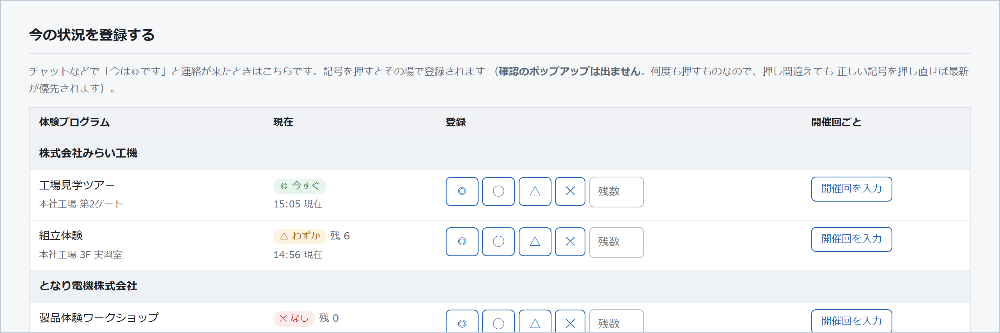
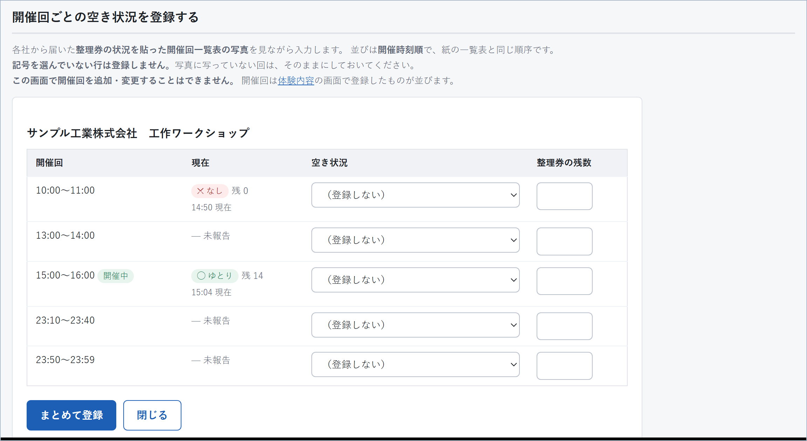
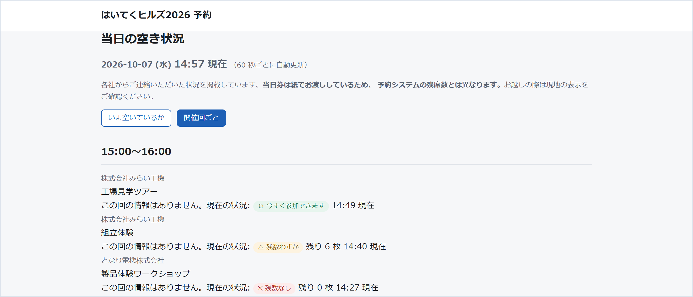
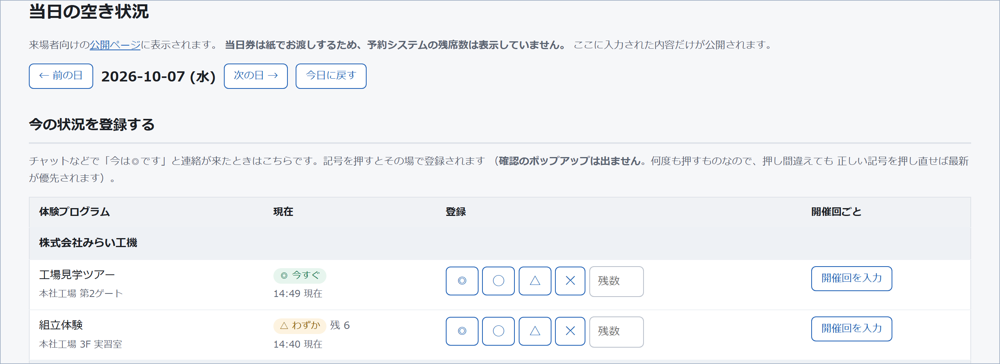
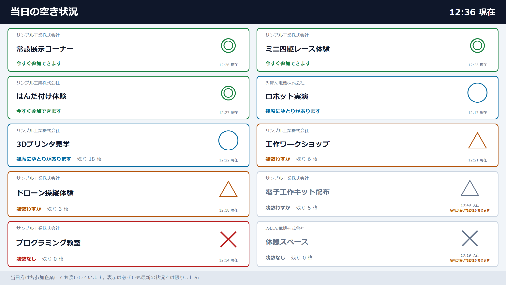
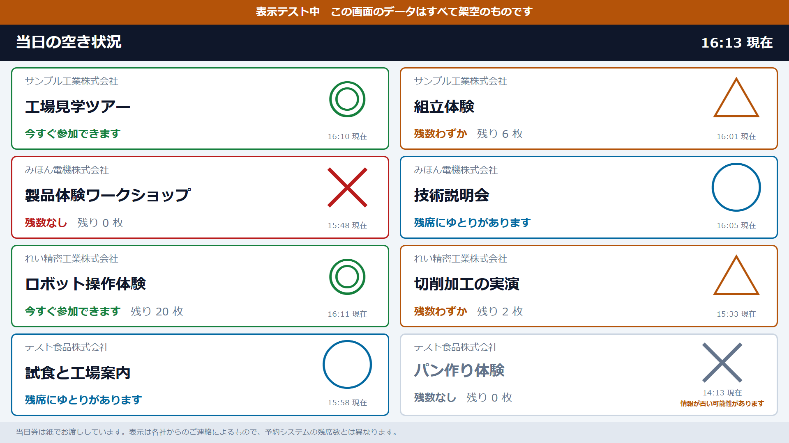

# 当日の空き状況 操作マニュアル

当日、各社の空き状況を来場者にお知らせするための機能です。
**事務局と会社担当者の両方が使います。**

この冊子は、予約システムの操作マニュアル（[事務局用](manual-office.md) ／ [会社担当者用](manual-company.md)）を
お読みいただいている前提で書いています。ログインのしかたや画面の基本は、そちらをご覧ください。

**日時はすべて日本時間です。**

> 研修や配布に使えるスライド版があります → **[manual-vacancy.pptx](manual-vacancy.pptx)**（PowerPoint、11 ページ）。内容はこの文書と同じです。

---

## 目次

1. [この機能がある理由](#1-この機能がある理由)
2. [記号の意味](#2-記号の意味)
3. [登録する — 今の状況](#3-登録する--今の状況)
4. [登録する — 開催回ごと（写真から転記）](#4-登録する--開催回ごと写真から転記)
5. [来場者に見えている画面](#5-来場者に見えている画面)
6. [サイネージ（事務局）](#6-サイネージ事務局)
7. [本番前のテストとリセット（事務局）](#7-本番前のテストとリセット事務局)
8. [当日の流れ](#8-当日の流れ)
9. [よくある質問](#9-よくある質問)

---

## 1. この機能がある理由

**当日券は紙でお渡しするため、予約システムは実際の残数を知りません。**

> 例: 定員 20 名・予約 12 名の回で、当日券を紙で 8 枚お配りした
> → システムは「残り 8 名」と言いますが、実際は満席です

そのため、この機能では**予約システムの残席数を一切表示しません。**
表示されるのは、**各社からご連絡いただき、人が入力した内容だけ**です。

つまり、**入力されなければ何も出ません。** 当日はこまめな更新が、そのまま画面の価値になります。

---

## 2. 記号の意味

| 記号 | 意味 |
|---|---|
| **◎** | 今すぐ参加できます |
| **◯** | 残席にゆとりがあります |
| **△** | 残数わずか |
| **✕** | 残数なし |

**整理券の残数**も一緒に登録できます（任意）。「△ 残数わずか（残り 6 枚）」のように併記されます。

> **記号が主、数字が従**です。残数は登録した直後に変わることがありますが、◎ や ✕ はしばらく正しいままです。
> 迷ったら、記号だけ登録してください。

**残数に 0 を入れると、記号は自動的に ✕ になります。** 「◎なのに残り 0 枚」という矛盾を防ぐためです。

---

## 3. 登録する — 今の状況

管理画面の「**空き状況**」メニューです。チャットなどで「今は◎です」とご連絡が来たときは、こちらを使います。

**開催回が登録されていない体験プログラム**（随時受付の展示など）も、ここに出ます。
その場合は「今の状況」だけを登録します（「開催回を入力」は出ません）。



**記号を押すと、その場で登録されます。**

- **確認のポップアップは出ません。** 当日は何度も押すものなので、毎回確認を求めると押されなくなるためです
- **押し間違えても大丈夫です。** 正しい記号を押し直してください。**いちばん新しい登録が優先**されます
- 押したあとは**同じ行に戻ります**。上までスクロールし直す必要はありません
- 残数も入れる場合は、記号を押す前に「残数」欄に数字を入れてください

「現在」の欄には、いま公開されている内容と、その登録時刻が出ます。
**90 分以上更新がないものには「⚠ 古い」**と付きます。

> 会社担当者の方には、**自社の体験プログラムだけ**が表示されます。

---

## 4. 登録する — 開催回ごと（写真から転記）

各社から「**整理券の状況を貼った開催回一覧表**」の写真が届いたときは、こちらです。
体験プログラムの行にある「**開催回を入力**」を押すと開きます。



- 並びは**開催時刻順**で、**紙の一覧表と同じ順序**です。上から順に写していけます
- **記号を選んでいない行は登録されません。** 写真に写っていない回は「（登録しない）」のままにしてください
- 入力し終えたら「**まとめて登録**」を 1 回押します。入力した行が一度に登録されます

> **「（登録しない）」のままにした行は、前の内容がそのまま残ります。** 消えるわけではありません。

---

## 5. 来場者に見えている画面

公開ページは **`（サイトのURL）/vacancy`** です。**ログインは不要**で、どなたでもご覧になれます。
**60 秒ごとに自動で最新になります。**

### いま空いているか（既定）



「今から行ける所はどこか」に答える画面です。体験プログラムごとに 1 行で出ます。

- **「—」は未報告**です。「空きがない」という意味ではありません
- 90 分以上更新がないものには「**⚠ 情報が古い可能性があります**」が付きます

### 開催回ごと



「15:00 の回はまだ取れるか」に答える画面です。**終わった回は出ません。**

その回の登録がない場合は、代わりに**その体験の「現在の状況」**が出ます。

```
組立体験   この回の情報はありません。現在の状況: △ 残数わずか（残り 6 枚）
```

回のことは分からなくても、そのブースが今どうなのかは分かるためです。
**別の情報だと分かるように、ラベルを変えて**出しています。

---

## 6. サイネージ（事務局）

会場のディスプレイに映すための表示です。



### 映しかた

ディスプレイにつないだ端末のブラウザで、次の URL を**全画面（キオスクモード）**で開くだけです。

```
（サイトのURL）/vacancy?display=signage
```

- **操作は不要です。** 開いたまま放置してください
- **自動でページが切り替わります**（既定: 8 件ずつ、20 秒ごと）
- **自動で最新になります。** 切り替えのたびに読み直しています
- **停電などで消えても、電源を入れ直せば元に戻ります**

### 会場に合わせて調整する

URL の後ろに付けて変えられます。現物を見てから決めてください。

| 付けるもの | 意味 | 例 |
|---|---|---|
| `&per=6` | 1 画面あたりの件数（既定 8） | 文字を大きくしたいとき減らす |
| `&interval=30` | 切り替えの秒数（既定 20） | ゆっくり読ませたいとき増やす |
| `&view=sessions` | 開催回ごとの表示にする | |

```
（サイトのURL）/vacancy?display=signage&per=6&interval=30
```

縦置きのディスプレイにも対応しています（自動で 1 列になります）。

### サイネージだけの決まり

- **未報告の体験は出しません。** 「—」ばかりの画面になると、報告のある体験が見えにくくなるためです
- **90 分以上更新がないものは灰色**になり、「情報が古い可能性があります」が付きます
  サイネージは誰も見ていない時間が長いため、**古い ◎ がいちばん危険**だからです

---

## 7. 本番前のテストとリセット（事務局）

### サイネージの表示テスト

**当日を待たずに、いつでも確認できます。** データも要りません。
「空き状況」画面の「**サイネージの表示テスト**」を押してください。



- **架空のデータ**が表示されます。◎◯△✕ の 4 つと、整理券の残数、
  「情報が古い」状態まで含まれているので、本番で出るすべての見え方を確認できます
- 画面上部に**オレンジ色の帯**が出ます。これが出ている間は**テスト表示**です
- **何も登録されません。** 公開ページには影響しません
- 文字の大きさを見るときは `?per=6` のように件数を変えて試してください

> この画面は**ログインが必要**です。来場者が架空のデータを見ることはありません。

### 練習したデータを消す（リセット）

本番前に練習で入力したものは、まとめて消せます。

```
php bin/reset_vacancy.php --date=2026-10-10 --dry-run   件数だけ確認
php bin/reset_vacancy.php --date=2026-10-10             その日の分を削除
php bin/reset_vacancy.php --event=123                   ある体験プログラムの分だけ
php bin/reset_vacancy.php --all                         すべて削除
```

> **消えるのは空き状況の報告だけです。予約データには一切触れません。**
> 全部消しても、予約・キャンセル待ち・座席数は何も変わりません。

SQL で直接行う場合は次のとおりです。

```sql
-- 一日分
DELETE v FROM vacancy_reports v
  LEFT JOIN event_sessions s ON s.id = v.session_id
 WHERE (v.session_id IS NOT NULL AND DATE(s.starts_at) = '2026-10-10')
    OR (v.session_id IS NULL     AND DATE(v.reported_at) = '2026-10-10');

-- すべて
DELETE FROM vacancy_reports;
```

---

## 8. 当日の流れ

### 事務局

1. 前日までに「**サイネージの表示テスト**」で見え方を確認しておく（→ [7 章](#7-本番前のテストとリセット事務局)）
2. 練習で入力したものがあれば `bin/reset_vacancy.php` で消しておく
3. 朝、各社に「空き状況のご連絡をお願いします」と周知する
4. サイネージ用の端末で `?display=signage` を全画面表示にする
5. チャットで届いた連絡を「**今の状況**」に入力する（→ [3 章](#3-登録する--今の状況)）
6. 開催回一覧表の写真が届いたら「**開催回を入力**」で転記する（→ [4 章](#4-登録する--開催回ごと写真から転記)）
7. ときどき「現在」の欄を見て、**「⚠ 古い」が増えていないか**確認する。増えていたら、その会社に連絡を促す

### 会社担当者

1. 管理画面の「**空き状況**」を開く（自社のぶんだけが出ます）
2. 状況が変わったら記号を押す。**押すだけで公開されます**
3. 満席になったら忘れずに **✕** を押す

> **いちばん困るのは、◎のまま更新が止まることです。** 来場者が向かってしまいます。
> 満席になった瞬間の ✕ が、いちばん価値のある 1 クリックです。

---

## 9. よくある質問

### 入力したのに公開ページに出ません

- 日付をご確認ください。画面上部の日付が**当日**になっていますか
- その体験プログラムと会社が**公開**になっていますか（非公開のものは来場者に出ません）

### 間違えて登録しました

**正しい内容で登録し直してください。** いちばん新しい登録が公開されます。
取り消し機能はありませんが、登録はすべて履歴として残るので、やり直しても記録は失われません。

### 「—」と「✕」はどう違いますか

| | 意味 |
|---|---|
| **—** | **まだご連絡をいただいていません**（空きがあるかどうか不明） |
| **✕** | **残数なし**とご連絡をいただきました |

来場者にもこの違いが伝わるよう、公開ページの下部に説明を出しています。

### 予約システムの残席数と違います

**違っていて正しいです。** 当日券は紙でお渡ししているため、予約システムは当日配った枚数を知りません。
この画面に出るのは、各社からご連絡いただいた内容だけです。

### 「開催回を入力」が出ない体験があります

**その日に開催回が登録されていない体験プログラムです。** 随時受付の展示などがこれにあたります。
「今の状況」だけを登録してください。それで公開ページに出ます。

### 開催回ごとに全部入力しないといけませんか

**いいえ。** 「今の状況」だけでも公開ページには出ます。
開催回ごとの入力は、「15:00 の回だけ満席」のように**回によって差があるとき**に使ってください。

### 前日や翌日の状況も見られますか

はい。管理画面の「← 前の日 / 次の日 →」で移動できます。
公開ページも `?date=2026-10-10` のように指定できます（通常は当日が出ます）。

---

## 困ったときは

画面のメッセージで解決しない場合は、事務局にご連絡ください。
その際、**操作した画面・押したボタン・表示されたメッセージ・おおよその時刻**をお伝えいただくと、原因を特定しやすくなります。
